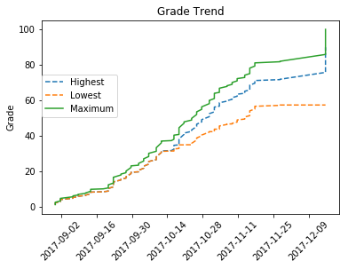
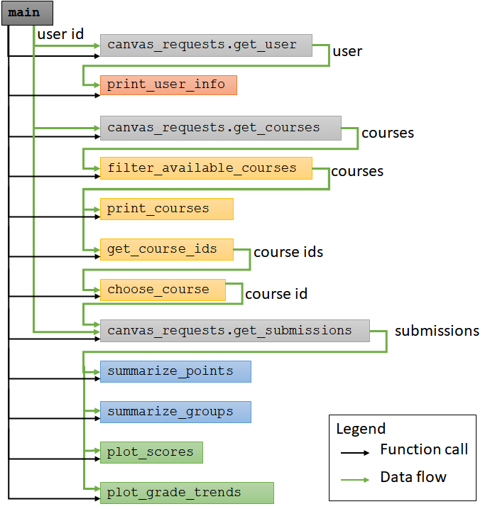

# CISC108 Canvas Analyzer
*Student-built tool for analyzing Canvas data*



Many modern websites have an API, or Application Programming Interface: a 
list of URLs that you can use to access data programatically. 
For example, there are URLs to get a list of available courses, to 
submit an assignment for grading, and to get a list of all submissions in a course.
The Canvas website that you are on right now is actually using this API behind the
scenes in order to do all of its actions. As a developer, you can get access to this
API to fully expose all the features of Canvas from within Python.

In this project, you will be creating a tool to analyze data from the
Canvas Learning Management System. Specifically, your tool will be able
to report information about your profile, your courses, and your submissions
in those courses. It will have a simple command line interface for selecting a course
and generate both textual statistics and plots. The correctness of your program will
be assessed using Unit Tests for some mock data. Although some code will be given to
you, this project will be more substantial than previous programming assignments.

This project asks you to demonstrate mastery of the following learning objectives:

* Manage data flow between functions
* Use a module that accesses external data
* Access highly structured data stored in lists and dictionaries
* Use while loops to process user input
* Apply loop patterns to calculate results
* Use the MatPlotLib module to create graphs
* Interpret a complex formula into code

# Canvas Requests

Clone this repository and get the following files:

* [canvas_analyzer.py](canvas_analyzer.py): This is the file you will be writing to analyze canvas data.
* [canvas_requests.py](canvas_requests.py): This file extends the Requests library to access data on Canvas. You will need to use but not modify this file.
* [test_my_solution.py](test_my_solution.py): This file is used to test your solution. You will need to run but not modify this file.
* [sample_output.txt](sample_output.txt): This file is used by the unit tests to evaluate your output. You can view this file to make sure you're printing out the right stuff.
* [sample_output.html](sample_output.html): This file demonstrates the output of running the analyzer on the mock data. You can view this file to make sure your graphs look about right.
* [sample_canvas_data.db](sample_canvas_data.db): This file holds the mock data used by the unit tester. You can ignore this file.

# Goal

The diagram below models how the main function calls the rest of the
functions. The data passed between function calls is indicated by
the green arrows (annotated with a description of the data), and
function calls are indicated by black arrows. The functions that are
in light gray boxes are given to you in the canvas_requests module,
and the results of calling them should be passed into the other
functions. The other colors group functions by their goal: pink is
user data, yellow handles courses, blue is for summary statistics,
and green is for plotting. Note: the main function is responsible for
directly calling all of the other 12 functions.



Your goal is to write the following 10 functions inside canvas_analyzer.py:

1. `main`: Consumes a string representing the user token (e.g., 'hermione') and calls all the other functions as shown in the diagram. The main function will be graded on Web-CAT based on the functions you have implemented; only include the functions you have implemented, but make sure you correctly call all the functions you do implement.
2. `print_user_info`: Consumes a User dictionary and prints out the user's name, title, primary email, and bio. It does not return anything. Note: this function consumes a dictionary, not a string; it does NOT call the canvas_requests.get_user function, it consumes the result of calling the function.
3. `filter_available_courses`: Consumes a list of Course dictionaries and returns a list of Course dictionaries where the workflow_state key's value is 'available' (as opposed to 'completed' or something else).
4. `print_courses`: Consumes a list of Course dictionaries and prints out the ID and name of each course on separate lines.
5. `get_course_ids`: Consumes a list of Course dictionaries and returns a list of integers representing course IDs.
6. `choose_course`: Consumes a list of integers representing course IDs and prompts the user to enter a valid ID, and then returns an integer representing the user's chosen course ID. If the user does not enter a valid ID, the function repeatedly loops until they type in a valid ID. You will need to use the input function to get the user's choice.
7. `summarize_points`: Consumes a list of Submission dictionaries and prints out three summary statistics about the submissions where there is a score (i.e. the submissions score is not None):
   * Points possible so far: The sum of the assignments' points_possible multiplied by the assignment's group_weight.
   * Points obtained: The sum of the submissions' score multiplied by the assignment's group_weight.
   * Current grade: the Points obtained divided by the Points possible so far, multiplied by 100 and rounded. Note that you can use the built-in round function.
8. `summarize_groups`: Consumes a list of Submission dictionaries and prints out the group name and unweighted grade for each group. The unweighted grade is the total score for the group's submissions divided by the total points_possible for the group's submissions, multiplied by 100 and rounded. Like the summarize_points function, you should ignore the submission without a score (i.e. the submission's score is None). You are recommended to apply the Dictionary Summing Pattern to implement this function. This function is a little difficult, so you might want to complete the next function first.
9. `plot_scores`: Consumes a list of Submission dictionaries and plots each submissions' grade as a histogram. The grade is calculated as the submission's score multiplied by 100 and divided by the assignment's points_possible. You should only plot the submissions that have been graded (score is not None) and the assignment is worth more than 0 points (points_possible is not truthy). Title your graph as "Distribution of Grades", label the X-axis as "Grades", and label the Y-axis as "Number of Assignments".
10. `plot_grade_trends`: Consumes a list of Submission dictionaries and plots the grade trend of the submissions as a line plot. The grade trend contains three lines (ordered by the assignments' due_at date) that show you the range of grades you could get in the course:
    * Highest: The running sum of graded submission scores followed by the running sum of points still possible from ungraded assignments.
    * Lowest: The running sum of graded submission scores followed by the running sum if you scored 0 on all ungraded assignments.
    * Maximum: The running sum of the points possible on all assignments in the course.
   
# Notes

**Understanding the Formula**: Each line represents a running sum,
and cannot be calculated with a single loop. Each score or
points possible running sum must be multiplied by the assignment's
group_weight and 100, and divided by the maximum weighted points
possible of the course. Because this formula is so complicated, it
is explained further: [Reference - Grade Trend](reference/grade_trend.md)

**Due Dates on the X-Axis**: The x-axis of the graph will be the
due dates of the assignment. MatPlotLib is very good at plotting
datetime objects, and can correctly align them when used as the
arguments to the plt.plot function. However, Canvas returns due
dates as a string instead of as datetime objects, so you will
need to convert the strings. Canvas dates are always of the
format `"YYYY-MM-DDTHH:MM:SSZ"`. For example, `"2017-08-30T16:20:00Z"`
represents August 30th, 2017 at 4:20pm. The "T", "Z", "-", ":" are
always the same characters, but the other letters
("Y", "M", "D", "H", "M", and "S") will represent digits of the
year, month, day, hour, etc. You can extract these dates into
datetime objects with the strptime function and an appropriate
string formatter.

```python
import datetime
a_string_date = "2017-08-30T16:20:00Z"
due_at = datetime.datetime.strptime(a_string_date, "%Y-%m-%dT%H:%M:%SZ")
```

Refer to the [official documentation](https://docs.python.org/3.6/library/datetime.html#strftime-strptime-behavior) for more information.

**Labeling Lines**: Each line must be clearly labeled
("Highest", "Lowest", "Maximum") via a legend. Pass in a named label parameter to the plt.plot function, and then call the plt.legend() function afterwards. For example:

```python
plt.plot(x_data, y_data, label="First Line")
plt.legend()
plt.show()
```

**Styling Your Graph**: You are not required to style your graph in any particular way. Feel free to adjust colors, line styles, and the rotation of the x-axis ticks. You will need to title your graph "Grade Trend" and label the Y-axis as "Grade".